# Jarkom-Modul-4-T08-2021

Laporan Resmi Praktikum Jarkom Modul 3

Disusun oleh :
* Clarissa Fatimah (05311940000012)
* Alessandro Tionardo (05311940000018)
* Christoper Adrian Kusuma (05311940000022)

---

### Soal 

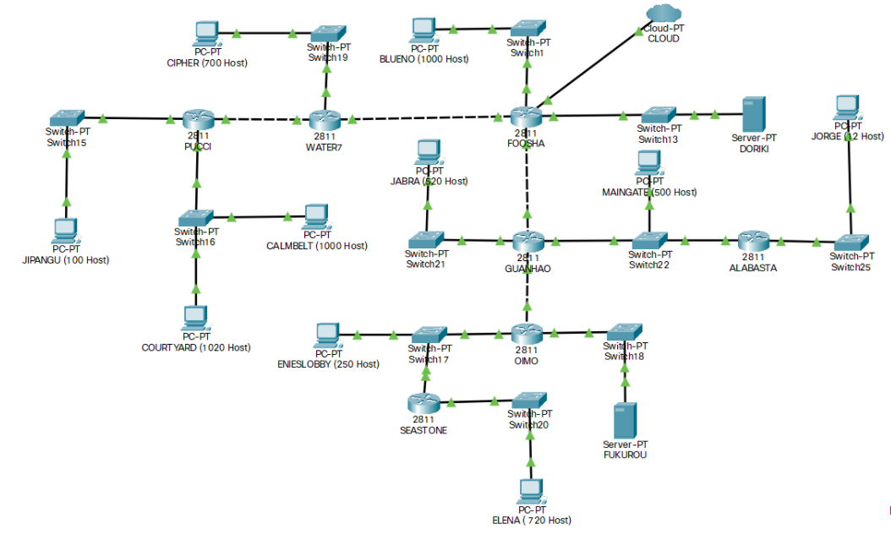

Soal shift dikerjakan pada Cisco Packet Tracer dan GNS3 menggunakan metode perhitungan CLASSLESS yang berbeda.

**Keterangan** : Bila di CPT menggunakan VLSM, maka di GNS3 menggunakan CIDR atau Sebaliknya.

## VLSM(Cisco Packet Tracer)

### Hasil perhitungan subnetting

| Subnet | Jumlah IP | Submask |  Network ID  |     Netmask    | 
|--------|-----------|---------| ------------ | -------------- |
| A1     | 1001      | /22     | 192.215.16.0 | 255.255.252.0  |
| A2     | 702       | /22     | 192.215.20.0 | 255.255.252.0  |
| A3     | 101       | /25     | 192.215.0.128| 255.255.255.128|
| A4     | 2021      | /21     | 192.215.8.0  | 255.255.248.0  |
| A5     | 2         | /30     | 192.215.0.0  | 255.255.255.252|
| A6     | 2         | /30     | 192.215.0.4  | 255.255.255.252|
| A7     | 521       | /22     | 192.215.24.0 | 255.255.252.0  |
| A8     | 721       | /22     | 192.215.28.0 | 255.255.252.0  |
| A9     | 252       | /24     | 192.215.1.0  | 255.255.255.0  |
| A10    | 2         | /30     | 192.215.0.8  | 255.255.255.252|
| A11    | 13        | /28     | 192.215.0.32 | 255.255.255.240|
| A12    | 502       | /23     | 192.215.2.0  | 255.255.254.0  |
| A13    | 2         | /30     | 192.215.0.12 | 255.255.255.252|
| A14    | 2         | /30     | 192.215.0.16 | 255.255.255.252|
| A15    | 2         | /30     | 192.215.0.20 | 255.255.255.252|
| **Total**  | **5845**      | **/19**     |


### Topologi
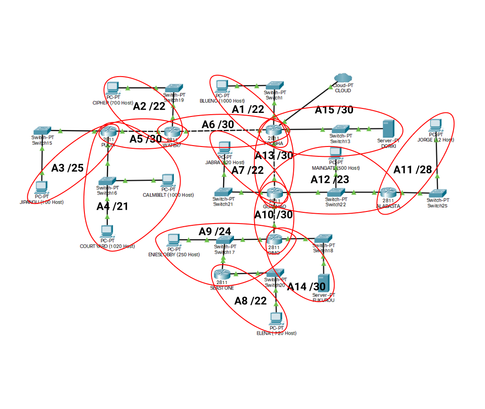

### Network address
<hr />

**FOOSHA**

```
192.215.0.4/30 via 192.215.0.5
192.215.20.0/22 via 192.215.0.5
192.215.0.0/30 via 192.215.0.5
192.215.0.128/25 via 192.215.0.5
192.215.8.0/21 via 192.215.0.5
192.215.0.12/30 via 192.215.0.13
192.215.24.0/22 via 192.215.0.13
192.215.2.0/23 via 192.215.0.13
192.215.0.32/28 via 192.215.0.13
192.215.0.20/30 via 192.215.0.13
192.215.28.0/22 via 192.215.0.13
192.215.1.0/24 via 192.215.0.13
192.215.0.8/30 via 192.215.0.13
```

**WATER7**

```
0.0.0.0/0 via 192.215.0.6
192.215.0.128/25 via 192.215.0.2
192.215.8.0/21 via 192.215.0.2
```

**PUCCI**

```
0.0.0.0/0 via 192.215.0.1
```

**GUANHAO**

```
0.0.0.0/0 via 192.215.0.14
192.215.0.32/28 via 192.215.2.1
192.215.0.8/30 via 192.215.0.9
192.215.0.20/30 via 192.215.0.9
192.215.1.0/24 via 192.215.0.9
192.215.28.0/22 via 192.215.0.9
```

**SEASTONE**

```
0.0.0.0/0 via 192.215.1.1
```

**OIIMO**

```
0.0.0.0/0 via 192.215.0.10
192.215.28.0/22 via 192.215.1.2
```

**ALABASTA**

```
0.0.0.0/0 via 192.215.2.2
```

### Pohon pembagian IP

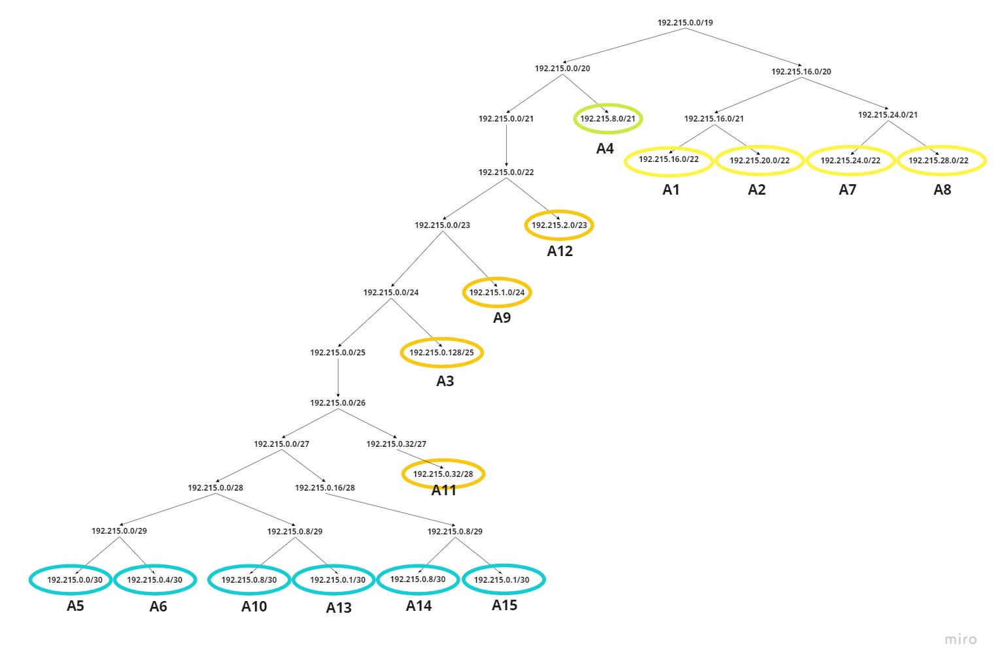

## CIDR(GNS3)

### Labelling Netmask

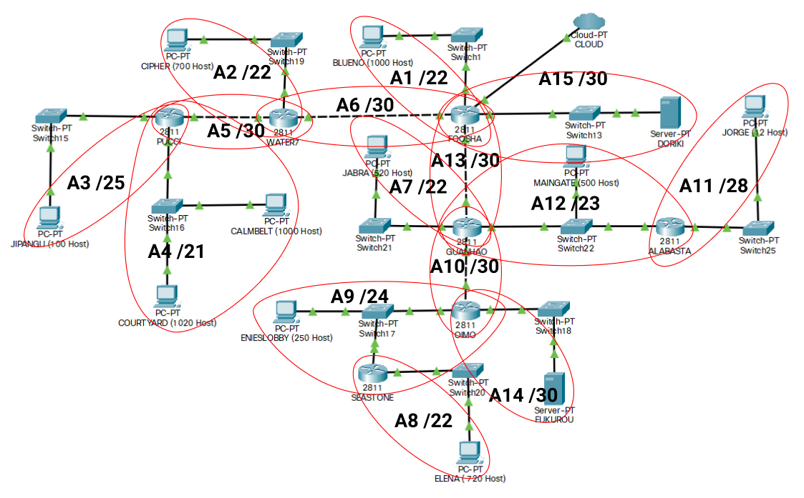
|:--:|
| **Label 1** |

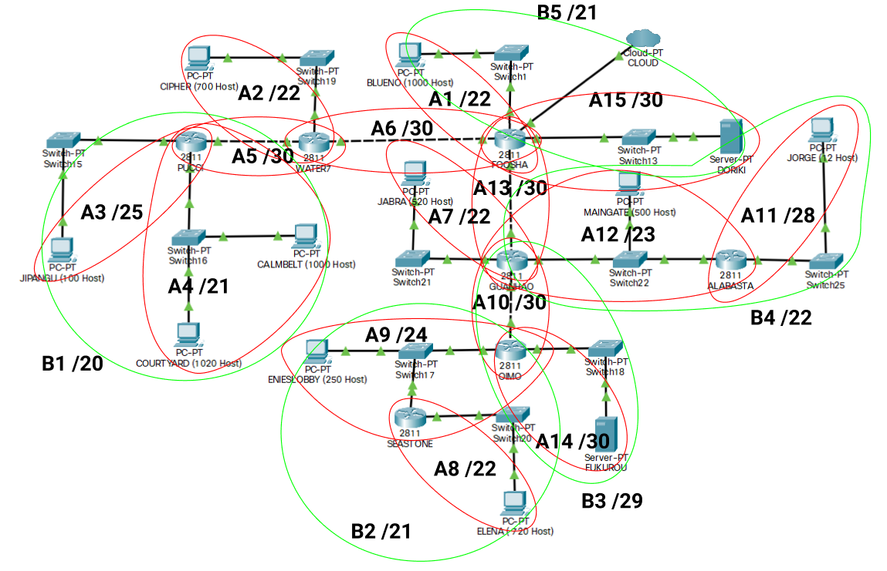
|:--:|
| **Label 2**|

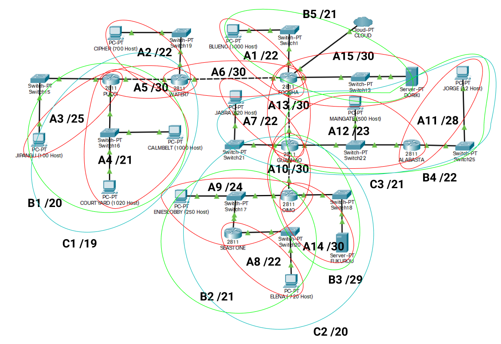
|:--:|
| **Label 3** |

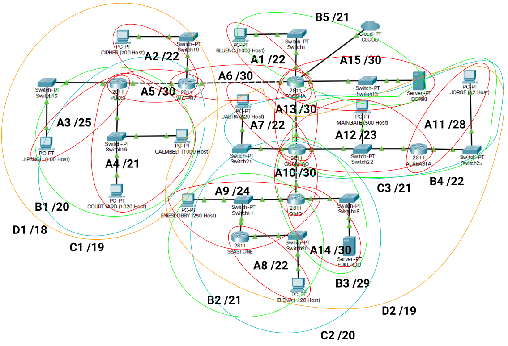
|:--:|
| **Label 4**|

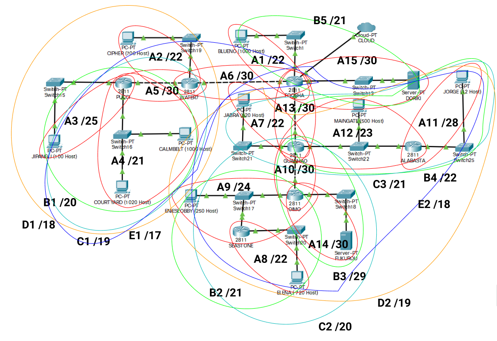
|:--:|
| **Label 5** |

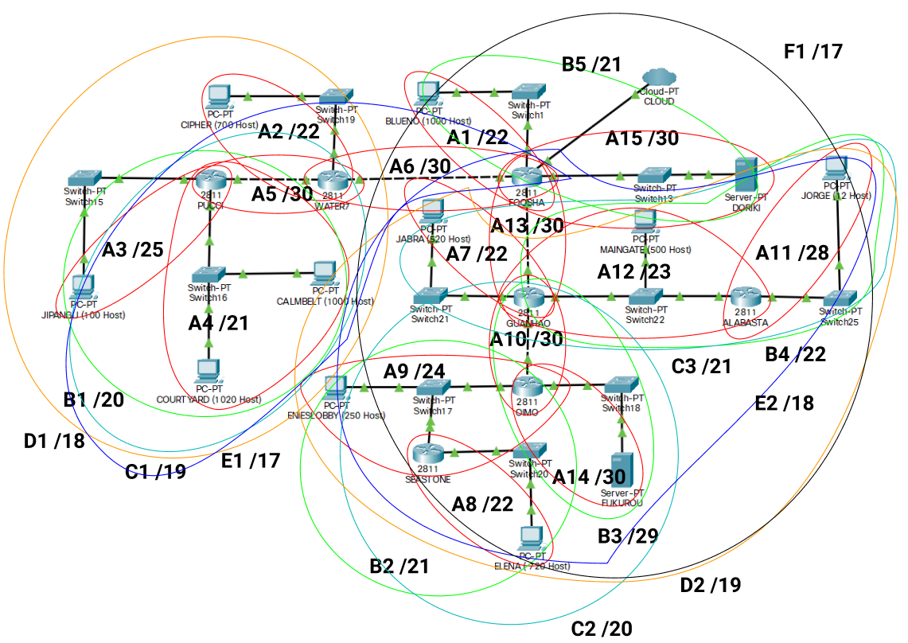
|:--:|
| **Label 6** |

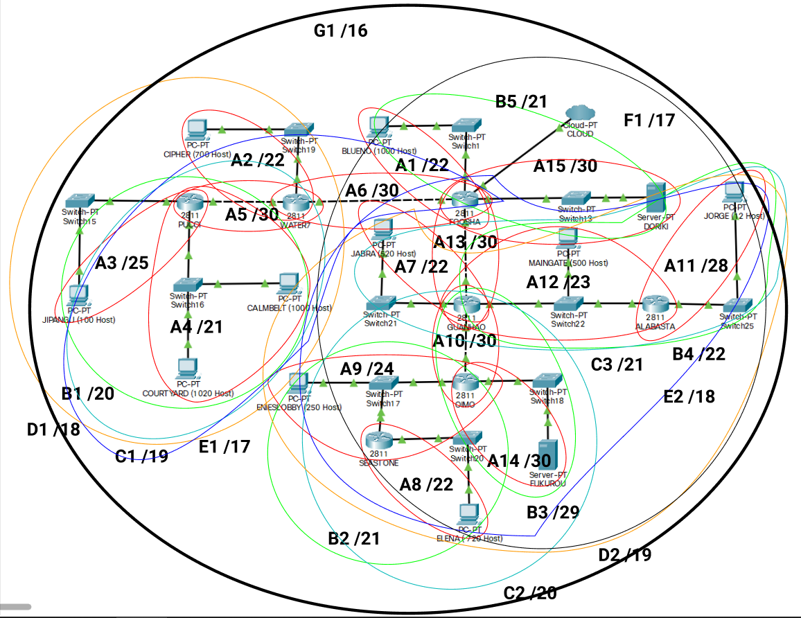
|:--:|
| **Label 7** |

### Tree CIDR

Kita menggunakan pembagian IP pada tree CIDR untuk setiap subnet.

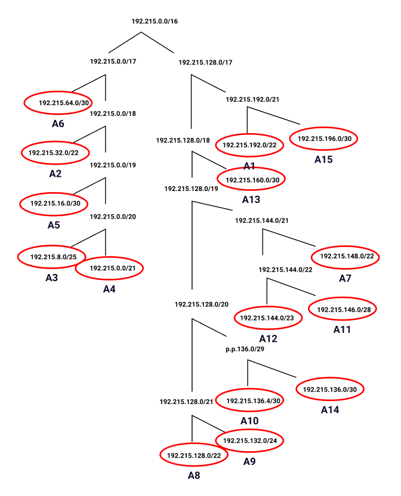

### Topologi GNS3

Membuat topologi GNS3 sesuai dengan topologi Soal Shift dan melakukan konfigurasi setiap alamat pada masing-masing router, client dan server sesuai dengan pembagian IP tree CIDR.

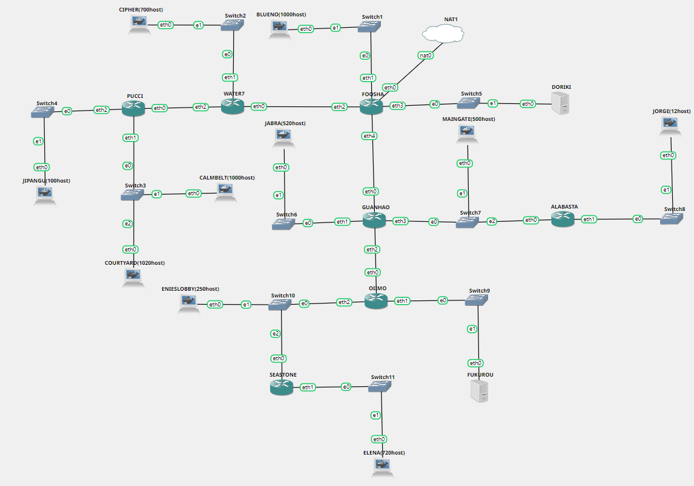

Setelah membuat topologi, melakukan routing pada setiap router :

**FOOSHA**
```
route add -net 192.215.32.0 netmask 255.255.252.0 gw 192.215.64.2
route add -net 192.215.16.0 netmask 255.255.255.252 gw 192.215.64.2
route add -net 192.215.8.0 netmask 255.255.255.128 gw 192.215.64.2
route add -net 192.215.0.0 netmask 255.255.248.0 gw 192.215.64.2
route add -net 192.215.148.0 netmask 255.255.252.0 gw 192.215.160.2
route add -net 192.215.144.0 netmask 255.255.254.0 gw 192.215.160.2
route add -net 192.215.146.0 netmask 255.255.255.240 gw 192.215.160.2
route add -net 192.215.136.4 netmask 255.255.255.252 gw 192.215.160.2
route add -net 192.215.136.0 netmask 255.255.255.252 gw 192.215.160.2
route add -net 192.215.132.0 netmask 255.255.255.0 gw 192.215.160.2
route add -net 192.215.128.0 netmask 255.255.252.0 gw 192.215.160.2
```

**WATER7**
```
route add -net 192.215.16.0 netmask 255.255.255.252 gw 192.215.16.2
route add -net 192.215.8.0 netmask 255.255.255.128 gw 192.215.16.2
route add -net 192.215.0.0 netmask 255.255.248.0 gw 192.215.16.2
```

**PUCCI**
```
route add -net 0.0.0.0 netmask 0.0.0.0 gw 192.215.16.1 
```

**GUANHAO**
```

route add -net 192.215.146.0 netmask 255.255.255.240 gw 192.215.144.3
route add -net 192.215.136.0 netmask 255.255.255.252 gw 192.215.136.6
route add -net 192.215.132.0 netmask 255.255.255.0 gw 192.215.136.6
route add -net 192.215.128.0 netmask 255.255.252.0 gw 192.215.136.6
```

**OIIMO**
```
route add -net 192.215.128.0 netmask 255.255.252.0 gw 192.215.132.3
```

**SEASTONE**
```
route add -net 0.0.0.0 netmask 0.0.0.0 gw 192.215.144.4
```
